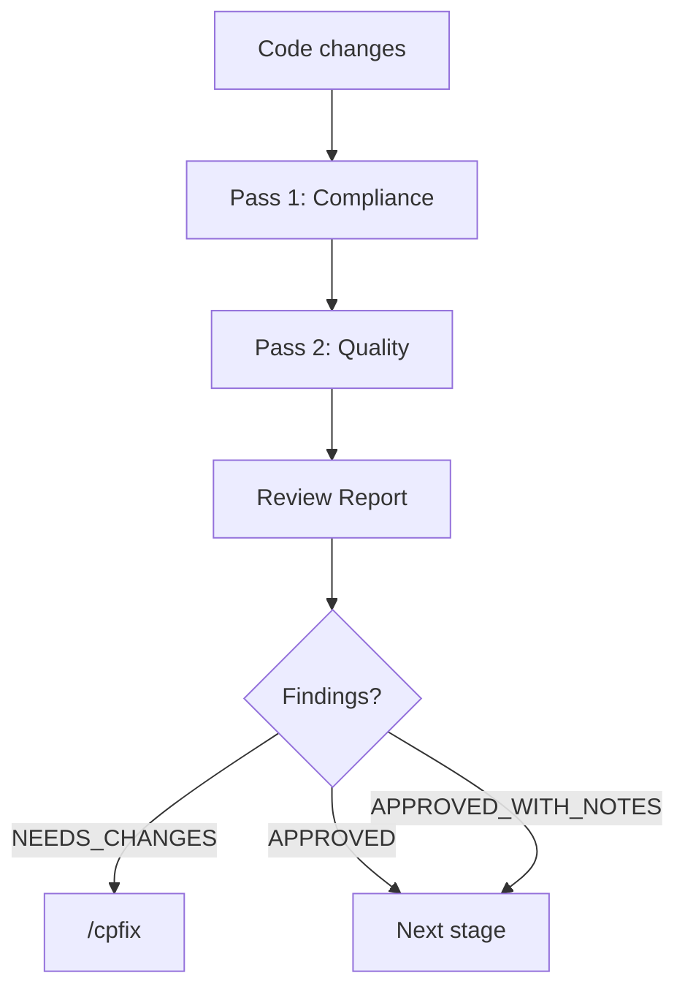

# Review System

## Purpose

Documents the code review architecture — two-pass model, specialized reviewers, report format, and fix tracking.

## When to read

- Running or configuring code review (`/cpreview`)
- Fixing findings (`/cpfix`)
- Understanding report format
- Adding a new reviewer specialization

## Scope

Covers `cpreview` mechanics, reviewer agents, report structure, and `cpfix` tracking. For the overall workflow position, see [Workflow](../shared/workflow.md).

## Related docs

- [Skills Reference](skills-reference.md) — all skills overview
- [Workflow](../shared/workflow.md) — where review fits in the pipeline

---

## Two-Pass Review Model



### Pass 1 — Compliance (mandatory first)

Checks adherence to:
- Approved design (`design.md`)
- Implementation plan (`plan.md`)
- Workflow decisions recorded in `workflow.md`
- Project rules (`.claude/rules/`, `CLAUDE.md` / `AGENTS.md`)

### Pass 2 — Quality

Four review dimensions, each with optional specialized reviewer:

| Dimension | Reviewer file | Subagent tier |
|-----------|--------------|---------------|
| Architecture | `architecture-reviewer.md` | default |
| Security | `security-reviewer.md` | default |
| Testing | `testing-reviewer.md` | default |
| Conventions | `codestyle-reviewer.md` | fast |

## Execution Models

| Scope | Strategy |
|-------|----------|
| Simple (few files) | Orchestrator handles both passes |
| Medium/Large | Dispatch specialized subagent reviewers in parallel (Claude) or sequentially (Codex) |

Compliance pass always uses **powerful** tier (most critical check).

## Specialized Reviewers

### Architecture Reviewer

- Module boundaries and single responsibility
- Dependency direction (no circular dependencies)
- Layering rules
- Composition over inheritance
- Dead code removal
- Plan compliance

### Security Reviewer

- Injection prevention (SQL, command, path traversal)
- Secrets and sensitive data exposure
- Input validation
- Authorization and IDOR
- Error handling (no sensitive data in errors)
- Concurrency safety

### Testing Reviewer

- Test coverage for new/changed code
- Test quality and edge cases
- Test isolation

### Codestyle Reviewer

- Naming conventions
- Code formatting
- Project style consistency

## Report Format

```markdown
## Code Review Report

### Summary
- Scope: N files
- Critical: N | Important: N | Minor: N
- Assessment: NEEDS_CHANGES | APPROVED | APPROVED_WITH_NOTES

### Critical Issues
1. [CATEGORY] `file:line` — description
   **Finding type:** compliance | quality
   **Fix:** concrete solution
   **Status:** open | resolved | skipped
   **Resolved via:** (filled after fix)
   **Resolution notes:** (filled after fix)
```

### Severity Levels

| Level | Meaning |
|-------|---------|
| Critical | Must fix before merge — correctness, security, compliance violation |
| Important | Should fix — architecture, maintainability concerns |
| Minor | Nice to fix — style, minor improvements |

### Assessment Values

| Assessment | Meaning |
|------------|---------|
| `NEEDS_CHANGES` | Has critical or important findings |
| `APPROVED_WITH_NOTES` | Minor findings only |
| `APPROVED` | No findings |

## Fix Tracking (cpfix)

### Processing Order

1. **Compliance findings first** — design/plan/rules violations
2. **Quality findings second** — architecture, security, testing, conventions
3. Within each group — preserve report order

### Incremental Report Mutation

After each finding is processed, **immediately** update the report file:

- `Status: open` → `resolved` | `skipped` | `deferred`
- Fill `Resolved via:` — what changed
- Fill `Resolution notes:` — brief explanation

This is **not batched** — each finding updates the report as it's resolved.

### Fix Agent

For subagent-dispatched fixes, the fix agent receives:
- Issue title, severity, finding type
- File path, problem description
- Chosen fix approach
- Project rules

The agent reads the target file, applies the fix, adds why-comments for non-trivial changes, updates tests if needed, and runs verification. Does not commit.

### Bounded Revalidation

After all fixes:
1. Confirm compliance risks are closed
2. Confirm quality fixes are complete
3. Revalidate only impacted sections — NOT full re-review

## Ad Hoc Save Gate

In ad hoc mode (no active workflow task):
- Report is generated **in conversation only**
- Report is **not saved to disk** until user explicitly approves
- Violating this gate is a critical workflow error

## Change Impact

- Adding a new reviewer dimension: create template in `cpreview/`, update review dispatch logic
- Changing report format: impacts cpfix parsing, cpresume detection, cprules analysis
- Modifying severity levels: impacts assessment logic across cpreview and cpfix
