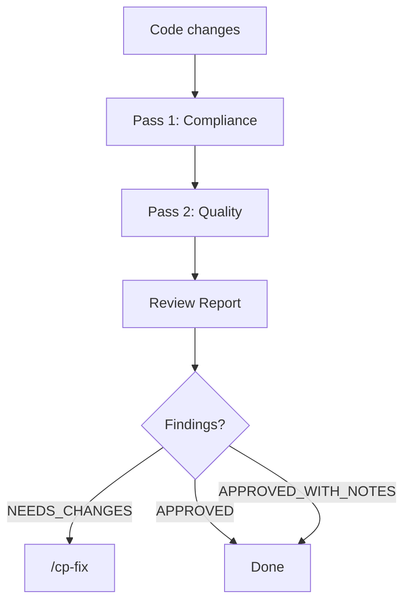

# Review System

## Purpose

Documents the code review architecture — two-pass model, specialized reviewers, report format, and fix tracking.

## When to read

- Running or configuring code review (`/cp-review`)
- Fixing findings (`/cp-fix`)
- Understanding report format
- Adding a new reviewer specialization

## Scope

Covers `cp-review` mechanics, reviewer agents, report structure, and `cp-fix` tracking.

## Related docs

- [Skills Reference](skills-reference.md) — all skills overview

---

## Two-Pass Review Model



### Pass 1 — Compliance (mandatory first)

Local triage builds one cited `prepared_context` package before any compliance or quality work. That package contains:

- exact reviewed files, grouped scope manifest, changed public surfaces, and evaluated routing predicates
- only applicable rule excerpts
- only applicable design, plan, documentation, and accepted-trade-off excerpts
- missing-context blockers

Each excerpt carries a concrete citation and exact text. Reviewers get only the subset relevant to their pass; missing required context is a blocker, not permission to infer.

`requires_deep_compliance` is true only when the scope has an applicable approved design or plan, changes a public API, touches a security-sensitive boundary, or potentially conflicts with an explicit requirement. `architecture_risk` is true for cross-package or cross-service boundaries, storage or data-model consistency, auth/authz boundaries, concurrency or background work, public API or SDK compatibility, or cross-cutting multi-module refactors.

For normal scope the orchestrator prepares `prepared_context` inline. A single fast read-only context preparer is allowed only for review scope above 20 files or when the relevant rules, design, and docs come from multiple sources.

When deep routing is not required, the orchestrator checks extracted requirements locally and stops before quality on any compliance violation.

### Pass 2 — Quality

Five review dimensions remain mandatory, but large low-risk scope can route them adaptively:

| Dimension | Reviewer file | Subagent tier |
|-----------|--------------|---------------|
| Architecture | `architecture-reviewer.md` | default, or powerful when `architecture_risk` is true |
| Security | `security-reviewer.md` | default |
| Testing | `testing-reviewer.md` | default |
| Conventions | `codestyle-reviewer.md` | fast |
| Compatibility | `compatibility-reviewer.md` | fast |

For large low-risk scope, one grouped `quality-reviewer` may cover architecture, security/reliability, and testing, and one grouped `quick-reviewer` may cover conventions and compatibility. Grouped reviewers still owe an explicit verdict for every assigned dimension. Security-sensitive scope still requires an independent security quality review; deep compliance never substitutes for it.

## Execution Models

Quality begins only after clean compliance.

| Scope | Quality strategy |
|-------|------------------|
| Simple (few files) | Orchestrator handles quality directly |
| Medium (6–20 files) | Orchestrator may dispatch quality subagents selectively |
| Large low-risk (>20 files) | Adaptive grouping: `quality-reviewer` + `quick-reviewer` |
| Large with `architecture_risk` | Separate powerful architecture reviewer plus other assigned reviewers |
| Large security-sensitive | Independent security reviewer in addition to other assigned reviewers |

## Specialized Reviewers

### Architecture Reviewer

- Module boundaries and single responsibility
- Dependency direction (no circular dependencies)
- Layering rules
- Composition over inheritance
- Dead code removal
- Plan compliance

### Security Reviewer

- Injection prevention (SQL, command, path traversal)
- Secrets and sensitive data exposure
- Input validation
- Authorization and IDOR
- Error handling (no sensitive data in errors)
- Concurrency safety

### Testing Reviewer

- Test coverage for new/changed code
- Test quality and edge cases
- Test isolation

### Codestyle Reviewer

- Naming conventions
- Code formatting
- Project style consistency

### Compatibility Reviewer

- Deprecated API usage (libraries, frameworks, language standard library)
- Version compatibility (APIs match declared dependency versions)
- Breaking changes awareness (no reliance on undocumented/internal APIs)
- Default severity: Minor; escalate to Important/Critical based on removal timeline
- Project rules can whitelist specific deprecated APIs or disable the check entirely

## Report Format

```markdown
## Code Review Report

### Summary
- Scope: N files
- Critical: N | Important: N | Minor: N
- Assessment: NEEDS_CHANGES | APPROVED | APPROVED_WITH_NOTES

### Critical Issues
1. [CATEGORY] `file:line` — description
   **Finding type:** compliance | quality
   **Fix:** concrete solution
   **Status:** open | resolved | skipped
   **Resolved via:** (filled after fix)
   **Resolution notes:** (filled after fix)
```

### Severity Levels

| Level | Meaning |
|-------|---------|
| Critical | Must fix before merge — correctness, security, compliance violation |
| Important | Should fix — architecture, maintainability concerns |
| Minor | Nice to fix — style, minor improvements |

### Assessment Values

| Assessment | Meaning |
|------------|---------|
| `NEEDS_CHANGES` | Has critical or open compliance findings |
| `APPROVED_WITH_NOTES` | Only important/minor quality findings |
| `APPROVED` | No findings |

## Fix Tracking (cp-fix)

### Processing Order

Strictly in report order — do not reorder by type or group. The review already places findings in the correct processing order.

### Incremental Report Mutation

After each finding is processed, **immediately** update the report file:

- `Status: open` → `resolved` | `skipped`
- Fill `Resolved via:` — what changed
- Fill `Resolution notes:` — brief explanation

This is **not batched** — each finding updates the report as it's resolved.

### Fix Agent

For subagent-dispatched fixes, the fix agent receives one finding, the chosen option from its Fix Decision Brief, and only the cited applicable rules for that finding.

`manual per item` is a hard gate: after preparing the brief, `/cp-fix` must not dispatch a fixer, edit files, run fix commands, or mutate report status until the user chooses an option, skips, or stops for that finding.

`auto safe fixes` are allowed only for one isolated simple repair with one safe option, no observable behavior/public API/schema/config change, and trivial rollback. Standard, complex, ambiguous, or high-risk findings require the full brief and explicit user choice.

The agent reads the target file, applies the selected fix, updates tests if needed, and runs verification. Does not commit.

### Bounded Revalidation

After all fixes:
1. Confirm compliance risks are closed
2. Confirm quality fixes are complete
3. Revalidate only impacted sections — NOT full re-review

### Documentation Check

After all fixes and final verification, cp-fix checks if changes affect anything documented in `.ai/docs/`. If so, it informs the user and suggests running `/cp-docs`.

## Ad Hoc Save Gate

When there is no task folder in `.ai/tasks/`:
- Report is generated **in conversation only**
- Report is **not saved to disk** until user explicitly approves
- Violating this gate is a critical workflow error

## Change Impact

- Adding a new reviewer dimension: create template in `cp-review/`, update review dispatch logic
- Changing report format: impacts cp-fix parsing and cp-rules analysis
- Modifying severity levels: impacts assessment logic across cp-review and cp-fix
