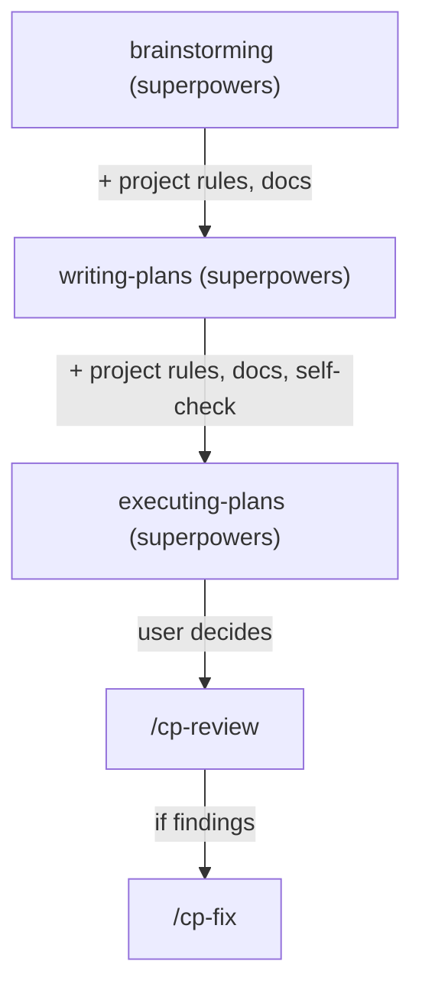

# Skills Reference

## Table of Contents
- [Purpose](#purpose)
- [When to read](#when-to-read)
- [Scope](#scope)
- [Related docs](#related-docs)
- [Integration Model](#integration-model)
- [Skills Overview](#skills-overview)
- [Task Artifacts](#task-artifacts)
- [Shared Mechanics](#shared-mechanics)
- [Change Impact](#change-impact)

## Purpose

Reference for all CodePatrol skills — purpose, inputs/outputs, and how they integrate with Superpowers.

## When to read

- Looking up what a specific skill does
- Understanding how CodePatrol integrates with Superpowers workflow
- Adding or modifying a skill

## Scope

All skills in `templates/`. For build mechanics see [Architecture](../shared/architecture.md).

## Related docs

- [Review System](review-system.md) — detailed review mechanics
- [Architecture](../shared/architecture.md) — template system

---

## Integration Model

CodePatrol **enhances** the Superpowers workflow chain instead of replacing it:



`using-codepatrol` defines the enhancements that are applied to brainstorming and writing-plans.

`using-codepatrol` activates only for explicit planning or a pre-edit decision requiring user approval. Direct,
well-scoped work bypasses this chain.

## Skills Overview

| Skill | Purpose | Detailed doc |
|-------|---------|-------------|
| [using-codepatrol](skills/using-codepatrol.md) | Gated planning enhancements and delegated self-checks | [details](skills/using-codepatrol.md) |
| [cp-review](skills/cp-review.md) | Two-pass code review (compliance + quality) | [details](skills/cp-review.md) |
| [cp-fix](skills/cp-fix.md) | Fix code review findings | [details](skills/cp-fix.md) |
| [cp-docs](skills/cp-docs.md) | Create and maintain AI-facing project documentation | [details](skills/cp-docs.md) |

## Task Artifacts

All task artifacts are stored in `.ai/tasks/`:

```
.ai/tasks/YYYY-MM-DD-HHMM-slug/
├── design.md    — approved design (saved by brainstorming)
├── plan.md      — implementation plan (saved by writing-plans)
└── review.md    — code review report (saved by /cp-review)
```

Ad-hoc review reports (no task context): `.ai/reports/YYYY-MM-DD-HHMM-<scope>.review.md`

## Shared Mechanics

| Mechanic | Used by | Description |
|----------|---------|-------------|
| Progress tracking | cp-review, cp-fix | Mandatory — progress items before starting work |
| Incremental report mutation | cp-fix | Report updated after each finding (not batched) |
| Ad hoc save gate | cp-review, cp-fix | File not saved without explicit user approval |
| Bounded revalidation | cp-fix | Revalidation only of impacted sections |
| Model policy | cp-review, cp-fix | Logical subagent tiers with platform-specific model mapping |
| Delegated planning self-checks | using-codepatrol | Artifact integrity on fast, plan feasibility on default, compliance on powerful |

## Change Impact

- Changing planning enhancements or task-artifact storage: update using-codepatrol
- Changing report format: impacts cp-fix parsing
- Modifying enhancement definitions: update using-codepatrol template
