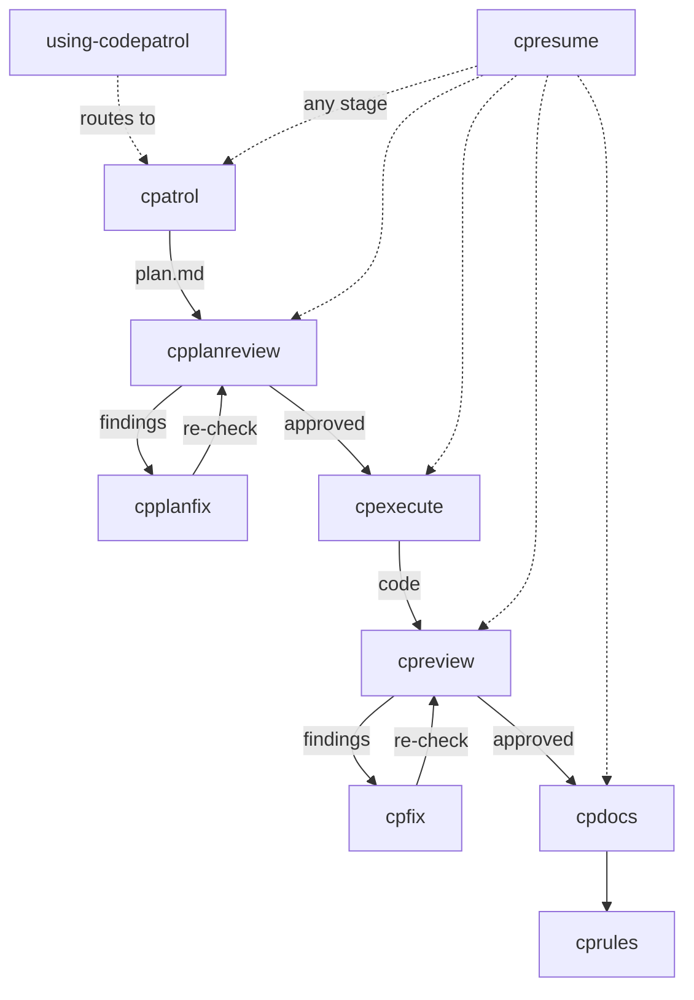

# Skills Reference

## Purpose

Reference for all CodePatrol skills — purpose, inputs/outputs, stages, and inter-skill dependencies.

## When to read

- Looking up what a specific skill does
- Understanding skill inputs and outputs
- Checking how skills connect to each other
- Adding or modifying a skill

## Scope

All skills in `templates/`. For build mechanics see [Architecture](../shared/architecture.md). For workflow overview see [Workflow](../shared/workflow.md).

## Related docs

- [Workflow](../shared/workflow.md) — pipeline and artifact storage
- [Review System](review-system.md) — detailed review mechanics
- [Architecture](../shared/architecture.md) — template system

---

## Skills Overview

| Skill | Purpose | Detailed doc |
|-------|---------|-------------|
| [using-codepatrol](skills/using-codepatrol.md) | Маршрутизация задач к скиллам CodePatrol вместо генерических | [details](skills/using-codepatrol.md) |
| [cpatrol](skills/cpatrol.md) | Research, design, plan для новой задачи (entry point) | [details](skills/cpatrol.md) |
| [cpplanreview](skills/cpplanreview.md) | Валидация плана перед реализацией | [details](skills/cpplanreview.md) |
| [cpplanfix](skills/cpplanfix.md) | Исправление findings из plan review | [details](skills/cpplanfix.md) |
| [cpexecute](skills/cpexecute.md) | Реализация кода из утверждённого плана | [details](skills/cpexecute.md) |
| [cpreview](skills/cpreview.md) | Двухпроходный code review (compliance + quality) | [details](skills/cpreview.md) |
| [cpfix](skills/cpfix.md) | Исправление findings из code review | [details](skills/cpfix.md) |
| [cpdocs](skills/cpdocs.md) | Создание/обновление AI-facing документации | [details](skills/cpdocs.md) |
| [cpresume](skills/cpresume.md) | Восстановление прерванной работы | [details](skills/cpresume.md) |
| [cprules](skills/cprules.md) | Улучшение правил проекта из паттернов | [details](skills/cprules.md) |

## Workflow Pipeline

```
/cpatrol → /cpplanreview → /cpplanfix (if findings) → /cpexecute → /cpreview → /cpfix (if findings) → /cpdocs → /cprules (optional)
```

Cross-cutting: `/cpresume` — resume с любого этапа. `/using-codepatrol` — routing при старте.

## Shared Mechanics

| Механика | Где используется | Описание |
|----------|------------------|----------|
| Progress tracking | Все скиллы | Mandatory — progress items до старта работы |
| Incremental report mutation | cpplanfix, cpfix | Обновление отчёта после каждого finding (не batch) |
| Ad hoc save gate | cpplanreview, cpreview, cpplanfix, cpfix | Файл не сохраняется без explicit user approval |
| Model policy | cpatrol, cpplanreview, cpexecute, cpreview, cpdocs | Subagent tiers: fast/default/powerful + ceiling rule |
| Bounded revalidation | cpplanfix, cpfix | Revalidation только изменённых секций |
| Blocker policy | Все скиллы | Stop и ask при conflicts, ambiguity, verification failure |

## Inter-Skill Dependencies



## Change Impact

- Adding a new skill: create template dir, add SKILL.md with frontmatter, rebuild, update using-codepatrol mapping, add doc in `skills/`
- Modifying skill stages: update the skill doc + workflow doc + cpresume detection logic
- Changing report format: update cpfix/cpplanfix parsing + cpresume detection + cprules analysis
