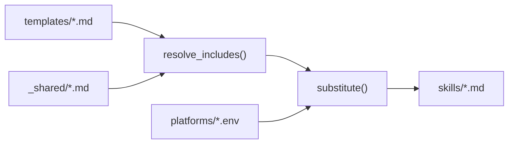

# Architecture

## Purpose

Documents the template system, build pipeline, platform abstraction, and plugin structure of CodePatrol.

## When to read

- Understanding how skills are generated from templates
- Adding or modifying a skill template
- Adding a new platform target
- Debugging build issues

## Scope

Covers `templates/`, `platforms/`, `install.sh`, `skills/`, `.claude-plugin/`. Does NOT cover individual skill behavior (see [Skills Reference](../domains/skills-reference.md)).

## Related docs

- [Skills Reference](../domains/skills-reference.md) — individual skill behavior
- [Workflow](workflow.md) — how skills form a workflow pipeline

---

## Project Structure

```
codepatrol/
├── templates/              # Source of truth for all skills
│   ├── _shared/            # Reusable partials (not a skill)
│   ├── cpatrol/            # Planning skill
│   ├── cpreview/           # Code review skill + reviewer prompts
│   ├── cpexecute/          # Implementation skill
│   ├── cpplanreview/       # Plan review skill
│   ├── cpplanfix/          # Plan fix skill
│   ├── cpfix/              # Code fix skill + fix agent prompt
│   ├── cpdocs/             # Documentation skill
│   ├── cpresume/           # Resume skill
│   ├── cprules/            # Rules evolution skill
│   └── using-codepatrol/   # Priority declaration skill
├── platforms/              # Platform-specific variable files
│   ├── claude.env
│   └── codex.env
├── skills/                 # Generated output (DO NOT EDIT)
├── .claude-plugin/         # Plugin manifests
│   ├── plugin.json
│   └── marketplace.json
└── install.sh              # Build and install script
```

## Template System

### Placeholders

Templates use `{{VARIABLE}}` syntax for platform-specific values. Variables are defined in `platforms/*.env`.

Key variables:

| Variable | Claude Code | Codex CLI |
|----------|-------------|-----------|
| `{{ASK_USER}}` | `AskUserQuestion` | `request_user_input` |
| `{{DISPATCH_AGENT}}` | Parallel via Agent tool | Sequential execution |
| `{{PROGRESS_TOOL}}` | `TodoWrite` | *(empty — line removed)* |
| `{{FILE_DISCOVERY}}` | Glob, Grep, MCP tools | Available search tools |
| `{{INVOKE_SKILL}}` | Skill tool invocation | Manual command suggestion |
| `{{RULES_SOURCE}}` | `.claude/rules/*.md` + `CLAUDE.md` | `AGENTS.md` only |
| `{{SKILLS_DIR}}` | `~/.claude/skills` | `~/.codex/skills` |

### Include Directives

Templates reference shared content with `{{@include:path}}`:

```markdown
{{@include:_shared/model-policy.md}}
```

The build script resolves these by inlining the referenced file content.

### Shared Partials (`templates/_shared/`)

Reusable content included by multiple skills:

- **model-policy.md** — Subagent model tier selection policy (fast/default/powerful), ceiling rule, escalation on failure. Included by: `cpatrol`, `cpreview`, `cpexecute`, `cpplanreview`, `cpdocs`.

## Build Pipeline



### `install.sh` Commands

| Command | Action |
|---------|--------|
| `./install.sh build` | Regenerate `skills/` from templates using Claude env |
| `./install.sh claude` | Generate and install to `~/.claude/skills/` |
| `./install.sh codex` | Generate and install to `~/.codex/skills/` |

### Build Steps

1. **resolve_includes(file, base_dir)** — finds `{{@include:...}}` directives, replaces with file content (portable awk)
2. **substitute(template, env_file, output)** — copies template, resolves includes, replaces `{{KEY}}` with env values. Empty values → entire line removed
3. **generate(platform, output_dir)** — iterates `templates/` subdirs (excluding `_shared`), processes all `.md` files
4. **clean_installed_skills(target_dir)** — removes old skills before install (including legacy `code-review`, `code-review-fix`)

### Portability

Script uses POSIX-compatible awk and sed. Works on macOS (BSD) and Linux (GNU).

## Plugin System

### plugin.json

Declares plugin metadata: name (`codepatrol`), version, description, keywords.

### marketplace.json

Registers plugin in the Claude plugins marketplace. Owner: `unger1984`.

## Key Constraints

- **Templates are source of truth** — never edit `skills/` directly
- **Templates must be universal** — no hardcoded languages, frameworks, or project-specific data
- **Platform-specific values** go in `platforms/*.env` only
- **Shared content** goes in `templates/_shared/` only
- **All skill text in English** — LLM adapts to project language via project rules

## Change Impact

- Modifying `templates/_shared/model-policy.md` affects all skills that include it (5 skills)
- Modifying `platforms/*.env` affects all generated skills for that platform
- Adding a new skill requires: template dir + SKILL.md, rebuild, update plugin manifest if needed
