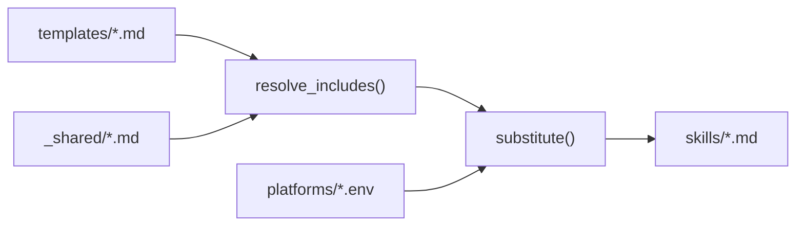

# Architecture

## Purpose

Documents the template system, build pipeline, platform abstraction, and plugin structure of CodePatrol.

## When to read

- Understanding how skills are generated from templates
- Adding or modifying a skill template
- Adding a new platform target
- Debugging build issues

## Scope

Covers `templates/`, `platforms/`, `install.sh`, `skills/`, `.claude-plugin/`. Does NOT cover individual skill behavior (see [Skills Reference](../domains/skills-reference.md)).

## Related docs

- [Skills Reference](../domains/skills-reference.md) — individual skill behavior

---

## Project Structure

```
codepatrol/
├── templates/              # Source of truth for all skills
│   ├── _shared/            # Reusable partials (not a skill)
│   ├── cp-review/          # Code review skill + reviewer prompts
│   ├── cp-fix/             # Code fix skill + fix agent prompt
│   ├── cp-docs/            # Documentation skill
│   ├── cp-rules/           # Rules evolution skill
│   └── using-codepatrol/   # Enhancement definitions
├── platforms/              # Platform-specific variable files
│   ├── claude.env
│   ├── codex.env
│   └── cursor.env
├── skills/                 # Generated output (DO NOT EDIT)
├── .claude-plugin/         # Plugin manifests
│   ├── plugin.json
│   └── marketplace.json
└── install.sh              # Build and install script
```

## Template System

### Placeholders

Templates use `{{VARIABLE}}` syntax for platform-specific values. Variables are defined in `platforms/*.env`.

Key variables:

| Variable | Claude Code | Codex CLI | Cursor |
|----------|-------------|-----------|--------|
| `{{ASK_USER}}` | `AskUserQuestion` | `request_user_input` | Built-in Ask Questions |
| `{{DISPATCH_AGENT}}` | Parallel via Agent tool | Sequential execution | Subagents via `.cursor/agents/` |
| `{{PROGRESS_TOOL}}` | `TodoWrite` | `checklist` | Checkpoints |
| `{{FILE_DISCOVERY}}` | Glob, Grep, MCP tools | Available search tools | Semantic Search + Search Files |
| `{{RULES_SOURCE}}` | `.claude/rules/*.md` + `CLAUDE.md` | `AGENTS.md` only | `.cursor/rules/*.mdc` + `AGENTS.md` |
| `{{SKILLS_DIR}}` | `~/.claude/skills` | `~/.codex/skills` | `~/.cursor/skills` |

OMP and OpenCode also consume the same templates through their platform env files; OMP keeps some output-schema prose duplicated deliberately because CodePatrol does not add a YAML frontmatter include/preprocessor for agent schema blocks.

### Include Directives

Templates reference shared content with `{{@include:path}}`:

```markdown
{{@include:_shared/model-policy.md}}
```

The build script resolves these by inlining the referenced file content.

#### Platform-specific includes

`{{@platform-include:name}}` — inlines `_shared/${name}-${platform}.md` where `${platform}` is determined by the build target (claude/codex/cursor). Used for platform-specific aliases, reviewer dispatch, fixer dispatch, planning self-checks, and rules authoring guidance.

### Shared Partials (`templates/_shared/`)

Reusable content included by multiple skills:

- **model-policy.md** — subagent model tier selection policy (fast/default/powerful), ceiling rule, escalation on failure
- **researcher.md** — research subagent contract, cited source-map output, and narrow re-read discipline
- **reviewer-dispatch-*.md** — platform-specific reviewer routing adapters, including adaptive quality grouping, cited `prepared_context`, and blocker handling
- **fixer-dispatch-*.md** — platform-specific fixer routing adapters, one finding per fixer, and cited applicable-rules payloads
- **planning-self-check-*.md** — platform-specific planning/design self-check dispatch using prepared context subsets
- **rules-authoring-*.md** — platform-specific rule authoring guidance
- **aliases-*.md** — platform-specific short command aliases

## Build Pipeline



### Build Commands

Both build scripts expose the same command surface for generation and validation:

| Command | Action |
|---------|--------|
| `./install.sh build` / `.\install.ps1 build` | Regenerate `skills/` from templates using Claude env |
| `./install.sh validate` / `.\install.ps1 validate` | Generate all five platforms in isolated temporary output, validate resolved Markdown and routing contracts; does not mutate `skills/` or installation directories |
| `./install.sh claude` / `.\install.ps1 claude` | Generate and install to `~/.claude/skills/` |
| `./install.sh codex` / `.\install.ps1 codex` | Generate and install to `~/.codex/skills/`; also removes legacy CodePatrol skills from the compatibility target |
| `./install.sh cursor` / `.\install.ps1 cursor` | Generate and install to `~/.cursor/skills/` |

### Build Steps

1. **resolve_includes(file, base_dir)** — finds `{{@include:...}}` directives, replaces with file content (portable awk / PowerShell string replacement)
2. **substitute(template, env_file, output)** — copies template, resolves includes, replaces `{{KEY}}` with env values. Empty values → entire line removed
3. **generate(platform, output_dir)** — iterates `templates/` subdirs (excluding `_shared`), processes all `.md` files
4. **validate()** — generates Claude, Codex, Cursor, OMP, and OpenCode in a temporary directory; rejects unresolved template markers and missing generated routing contracts without installing or mutating `skills/`
5. **clean_installed_skills(target_dir)** — removes old skills before install (including legacy names)

### Portability

`install.sh` uses POSIX-compatible awk and sed. `install.ps1` mirrors the same contract for Windows/PowerShell users.
## Plugin System

### plugin.json

Declares plugin metadata: name (`codepatrol`), version, description, keywords.

### marketplace.json

Registers plugin in the Claude plugins marketplace. Owner: `unger1984`.

## Key Constraints

- **Templates are source of truth** — never edit `skills/` directly
- **Templates must be universal** — no hardcoded languages, frameworks, or project-specific data
- **Platform-specific values** go in `platforms/*.env` only
- **Shared content** goes in `templates/_shared/` only
- **All skill text in English** — LLM adapts to project language via project rules

## Change Impact

- Modifying `templates/_shared/model-policy.md` affects all skills that include it
- Modifying `platforms/*.env` affects all generated skills for that platform
- Adding a new skill requires: template dir + SKILL.md, rebuild, update plugin manifest if needed
