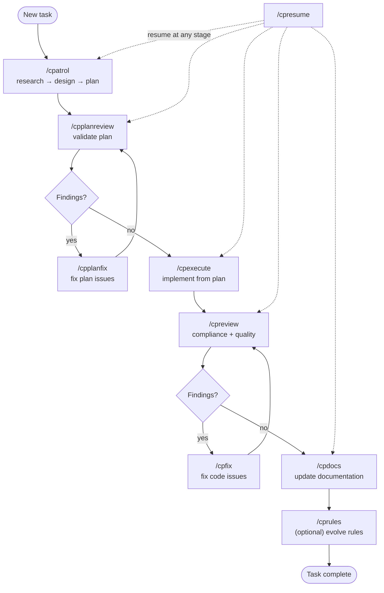

# Workflow

## Purpose

Documents the full task lifecycle — from planning through review to completion — and the artifact storage model that enables session resumability.

## When to read

- Understanding the overall workflow stages and their order
- Working with `.ai/tasks/` artifacts
- Resuming interrupted work
- Understanding how skills connect

## Scope

Covers workflow stages, artifact structure, resumability model, and cross-skill dependencies. For individual skill details, see [Skills Reference](../domains/skills-reference.md).

## Related docs

- [Skills Reference](../domains/skills-reference.md) — detailed skill behavior
- [Review System](../domains/review-system.md) — review and fix details
- [Architecture](architecture.md) — how skills are built

---

## Workflow Pipeline



## Cross-cutting Skills

| Skill | Behavior |
|-------|----------|
| `/cpresume` | Resumes at any stage by reading workflow artifacts |
| `/cpdocs` | Works in workflow mode (autonomous) or ad hoc mode (interactive) |
| `/cprules` | Analyzes patterns across completed tasks to propose rule improvements |

## Artifact Storage

### Task Directory Structure

```
.ai/tasks/<YYYY-MM-DD-HHMM-task-slug>/
├── <slug>.workflow.md              # Status, stage tracking, decisions
├── <slug>.design.md                # Approved architecture/design
├── <slug>.plan.md                  # Implementation plan
└── reports/
    ├── YYYY-MM-DD-HHMM-<slug>.plan-review.report.md
    └── YYYY-MM-DD-HHMM-<slug>.review.report.md
```

### Ad Hoc Reports

```
.ai/reports/
└── YYYY-MM-DD-HHMM-<scope>.review.report.md
```

### Documentation

```
.ai/docs/
├── README.md           # Navigation entry point
├── domains/            # Domain-specific docs
└── shared/             # Cross-cutting topics
```

## Resumability Model

- All artifacts are **append-only** (except tracking fields like status)
- Report tracking fields update **immediately after each finding** — not batched
- Task is resumable while `Status: in-progress` in workflow.md
- `/cpresume` reconstructs exact stage from artifacts: objective, status, last completed stage, blockers, next command

## Subagent Model

Skills dispatch subagents for parallelizable work. Model selection follows tiers:

| Tier | Use when |
|------|----------|
| **fast** | Simple, well-scoped tasks (e.g., conventions reviewer) |
| **default** | Most work requiring comprehension (e.g., architecture reviewer) |
| **powerful** | Complex reasoning, ambiguous constraints, escalation |

**Ceiling rule:** subagent model ≤ current session model.

**Escalation:** on failure, escalate one tier up (max once per subagent). If ceiling tier fails → blocker, ask user.

**User override:** project rules (CLAUDE.md/AGENTS.md) can define custom tier → model mapping.

## Key Workflow Rules

1. **Progress tracking is mandatory** — create progress items before starting, update as work proceeds
2. **Bounded revalidation** — after fixes, revalidate only impacted sections, not everything
3. **Ad hoc save gates** — in ad hoc mode, reports stay in conversation until user explicitly approves saving
4. **Blocker policy** — stop and ask user on critical conflicts, ambiguous intent, or verification failures
5. **No parallelization of fixes without user approval** — cpfix and cpplanfix process findings sequentially by default

## Change Impact

- Modifying workflow stages requires updating multiple skills and this document
- Adding a new stage requires considering resumability (cpresume must detect it)
- Changing artifact format impacts all skills that read/write artifacts
