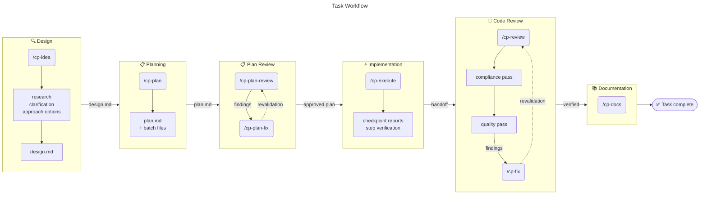
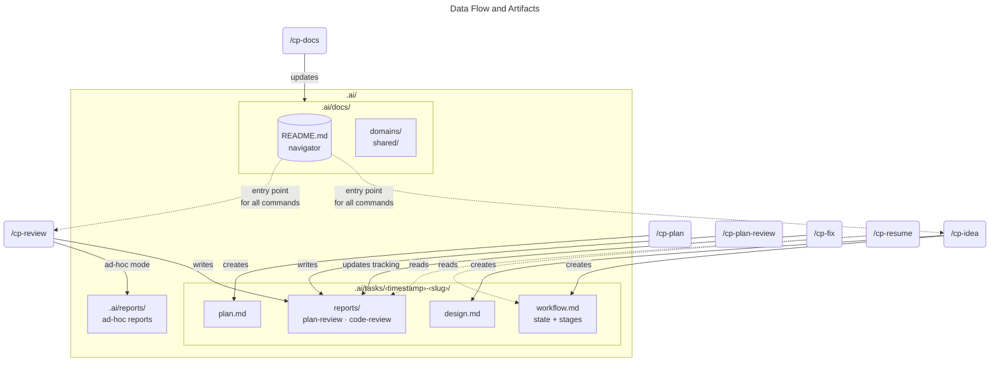
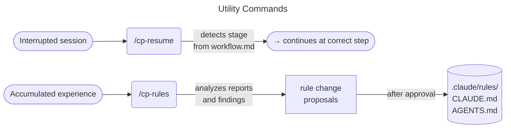

**English** | [Русский](README.ru.md)

# CodePatrol

Workflow-first skills for [Claude Code](https://docs.anthropic.com/en/docs/claude-code) and [Codex CLI](https://github.com/openai/codex). CodePatrol replaces the old review-only interaction with a full lifecycle workflow that keeps templates in `templates/` and platform differences in `platforms/*.env`.

## Inspiration

CodePatrol was inspired by [Superpowers](https://github.com/obra/superpowers) by Jesse Vincent — a pioneering skill-based workflow for coding agents. Superpowers showed that agents work dramatically better when guided by composable skills rather than ad-hoc prompts.

CodePatrol takes this idea further by adding structured artifact storage, session resumability, compliance-first reviews, and a full task lifecycle with audit trail.

## CodePatrol vs Superpowers

| Area | Superpowers | CodePatrol |
|------|------------|------------|
| **Approach** | Composable general-purpose skills that trigger automatically | Full lifecycle workflow with structured stages and handoffs |
| **Artifact storage** | No persistent structure — context lives in chat | `.ai/` directory: `workflow.md`, `design.md`, `plan.md`, reports |
| **Session resumability** | Start over in new session | `/cp-resume` restores exact stage from artifacts |
| **Code review** | Single-pass review against plan | Two-pass: compliance first (design/plan/rules), then quality (arch/security/tests/conventions) |
| **Review execution** | Single reviewer | Parallel specialized reviewers (architecture, security, testing, conventions) |
| **Fix tracking** | Manual | Incremental report mutation — each finding tracked with status, resolution, and evidence |
| **Plan writing** | Micro-step plans with full code | Adaptive granularity by executor tier; batch files for medium/large tasks |
| **Plan validation** | No dedicated step | `/cp-plan-review` → `/cp-plan-fix` cycle before implementation |
| **Documentation** | No dedicated step | `/cp-docs` — AI-oriented docs in `.ai/docs/` with ToC, cross-doc links, and validation |
| **Rule evolution** | No dedicated step | `/cp-rules` — proposes rule improvements from reports, research, or natural-language requests; diagnose mode |
| **Ad hoc mode** | N/A | Any command works outside workflow tasks; `/cp-docs` accepts natural-language requests |
| **Audit trail** | No | Append-only reports, workflow.md decision history |
| **Platform support** | Claude Code, Codex, Cursor, OpenCode | Claude Code, Codex CLI |

Both projects are MIT-licensed. They can coexist — Superpowers covers general development discipline (TDD, worktrees, brainstorming), while CodePatrol focuses on the structured task lifecycle with artifacts, reviews, and audit trail.

## Table of Contents

- [Quick Start](#quick-start)
- [Inspiration](#inspiration)
- [CodePatrol vs Superpowers](#codepatrol-vs-superpowers)
- [What CodePatrol Solves](#what-codepatrol-solves)
- [Workflow Overview](#workflow-overview)
- [Data Storage And Organization](#data-storage-and-organization)
- [How To Run](#how-to-run)
- [Session Example](#session-example)
- [Install](#install)
- [Rules And Context](#rules-and-context)
  - [Model Selection For Subagents](#model-selection-for-subagents)
- [Development](#development)
- [CI/CD](#cicd)
- [Known Limitations](#known-limitations)

## Quick Start

**Requirements:** [Claude Code](https://docs.anthropic.com/en/docs/claude-code) or [Codex CLI](https://github.com/openai/codex) installed.

```bash
# 1. Install skills
curl -fsSL https://raw.githubusercontent.com/unger1984/codepatrol/main/install-remote.sh | bash

# 2. Open your project in Claude Code
cd your-project

# 3. Start your first task
/cp-idea add caching to the API layer
```

CodePatrol will create `.ai/` in your project, run research, discuss the approach, and prepare a design. Then `/cp-plan` writes the implementation plan. The workflow guides you through each step.

## What CodePatrol Solves

- **Unified workflow surface:** One command set controls research, design, planning, execution, reviews, fixes, docs, and rule updates, hiding internal stage IDs from users.
- **Context-aware agents:** Every command begins from `.ai/docs/README.md` and workflow artifacts so agents only read what matters.
- **Audit-friendly artifacts:** `.ai/tasks/` tracks `<slug>.workflow.md`, `<slug>.design.md`, `<slug>.plan.md`, and review reports; fixes mutate only documented tracking fields.

## Workflow Overview







## Data Storage And Organization

CodePatrol creates an `.ai/` directory in the project that serves two purposes: long-term project memory and current task artifacts.

### `.ai/docs/` — Project Memory

Persistent AI-oriented documentation. This is not a duplicate of regular docs but a separate knowledge layer optimized for agents: architectural decisions, project patterns, domain-specific constraints.

`README.md` inside is the mandatory entry point. Every CodePatrol command starts context discovery from it, follows navigation to find relevant docs, and reads only what is needed. This prevents aimless repository scanning.

Created and updated by `/cp-docs` — both as a workflow step after task completion and via ad hoc natural-language requests.

### `.ai/tasks/` — Task Artifacts

Each workflow task lives in its own directory: `.ai/tasks/<YYYY-MM-DD-HHMM>-<slug>/`.

Inside are three core files created by `/cp-idea` and updated by subsequent commands:

- **`<slug>.workflow.md`** — central state file. Tracks the current stage, status, artifact references, stage completion, and key decisions. This is what `/cp-resume` uses to determine where to continue.
- **`<slug>.design.md`** — solution design. Produced during `/cp-idea` after research and approach discussion. One per task, edited iteratively.
- **`<slug>.plan.md`** — implementation plan. One per task, must pass `/cp-plan-review` before execution.

Tasks also contain `reports/` — plan review and code review reports. Reports are audit artifacts: `/cp-plan-fix` and `/cp-fix` update only tracking fields (status, resolution method, notes) but never delete or rewrite findings.

### `.ai/reports/` — Ad-hoc Reports

Reports outside workflow tasks. For example, `/cp-review` for an arbitrary branch or PR saves results here rather than in a task directory.

### Why This Matters

- **Resumability.** A task can be continued in a new session via `/cp-resume` — all context lives in artifacts, not chat memory.
- **Audit trail.** Decision history and findings are preserved — reports are append-only, workflow.md captures key decision points.
- **Context isolation.** Agents read `.ai/docs/README.md` → relevant docs → task artifacts → code. No bulk repository scanning.

## How To Run

Commands are entered in Claude Code or Codex CLI. Each command auto-discovers relevant artifacts from `.ai/tasks/` and `.ai/docs/`. If context is ambiguous, the command will ask.

### Full Task Workflow

The workflow is organized around a single task: one task = one design + one plan (the plan may be split into batch files, but it remains a single logical plan). A task is considered complete only after AI documentation is updated.

**1. Design — `/cp-idea`**

Single entry point. Checks for unfinished tasks and offers to resume them or start a new one. For a new task it runs a mandatory chain:
- **research** — gather context from `.ai/docs/`, code, and project rules;
- **clarification** — resolve ambiguities with the user;
- **approach options** — compare approaches with trade-offs and a recommendation;
- **design** — produce `design.md` with execution strategy.

Process depth adapts to the task: minimal for small fixes, full for large features.

**2. Plan — `/cp-plan`**

Writes the implementation plan from the approved design. Verifies context readiness (design, project rules, file map, contracts), adapts plan granularity to executor tier (strategic for strong models, detailed for weak ones). For medium and large tasks, splits the plan into batch files for compact executor context.

**3. Plan review — `/cp-plan-review` → `/cp-plan-fix`**

Before implementation the plan is checked against the design, project rules, and execution readiness. `/cp-plan-review` saves a report with findings, `/cp-plan-fix` resolves them and runs bounded revalidation.

**4. Implementation — `/cp-execute`**

Executes the approved plan step by step with checkpoint reports. Stops on blockers instead of guessing. On completion it offers to proceed to code review — in the current session or hand off to a new one.

**5. Code review — `/cp-review` → `/cp-fix`**

`/cp-review` runs compliance first (design, plan, and rules alignment), then quality (architecture, style, tests, security). The report is saved as `.review.report.md`. `/cp-fix` resolves findings in report order.

**6. Documentation — `/cp-docs`**

Updates AI-oriented documentation in `.ai/docs/` based on the task results. Runs a validation pass: checks navigation, placement, and code alignment.

Also works in ad hoc mode: `/cp-docs add a data flow diagram for the auth module` — parses the request, researches the codebase, and creates or updates the appropriate doc.

### Utility Commands

- `/cp-resume` — continue an unfinished task. Loads artifacts, detects the current stage, and shows what to do next.
- `/cp-rules` — not part of the mandatory workflow. Analyzes reports, recurring findings, or a specific topic area and proposes numbered rule improvements grouped by category. Also supports diagnose mode: "why didn't rules apply?" — investigates and proposes fixes. Changes are applied only after user approval.

### Notes

- Any command accepts an explicit artifact path: `/cp-resume .ai/tasks/2026-03-06-1420-my-task/`.
- `/cp-review` also works outside the workflow — you can review a branch, PR, directory, or file set.
- When a command asks “which artifact?”, answer with a path or a short form: `current task`, `new task`.
- CodePatrol installs a routing skill (`using-codepatrol`) that maps short aliases (`/idea`, `/plan`, `/review`...) and natural language intents to the right command.

## Session Example

```
> /cp-idea add rate limiting for the API

🔍 Research: reading .ai/docs/README.md → docs/domains/api.md → src/api/...
Found: Express + Redis, 12 endpoints, JWT authentication.

❓ Clarification:
  1. Same limits for all endpoints or split by group?
  2. Store counters in Redis (already in project) or in-memory?
  → Recommendation: Redis + different limits for auth vs data endpoints.

> 1 — by group, 2 — Redis, agree with recommendation

📐 Design: created .ai/tasks/2026-03-06-1420-rate-limiting/rate-limiting.design.md

📋 Plan: auto-invoked /cp-plan — created rate-limiting.plan.md (3 stages, 2 batch files)
   Rules compliance pre-check: passed

✅ Plan review: auto-invoked /cp-plan-review
   Findings: 1 minor (no fallback when Redis is unavailable)

🔧 Plan fix: auto-invoked /cp-plan-fix
   Fixed: added in-memory counter fallback.
   Revalidation passed. Next step → /cp-execute

> /cp-execute

⚡ Stage 1/3: middleware created, tests passing
⚡ Stage 2/3: limit config by group, integration tests ok
⚡ Stage 3/3: documentation updated
   Implementation complete. Next step → /cp-review

> /cp-review

📝 Compliance: ok (matches design and plan)
📝 Quality: 1 important (middleware does not log rejected requests)
   Report: .ai/tasks/.../reports/...-rate-limiting.review.report.md
   Next step → /cp-fix

> /cp-fix

🔧 Added logging. Verification passed.
   Next step → /cp-docs

> /cp-docs

📚 Updated .ai/docs/domains/api.md (added rate limiting section)
   Task complete.
```

## Install

### Latest release

```bash
# Claude Code
curl -fsSL https://raw.githubusercontent.com/unger1984/codepatrol/main/install-remote.sh | bash

# Codex CLI
curl -fsSL https://raw.githubusercontent.com/unger1984/codepatrol/main/install-remote.sh | bash -s codex
```

### Claude marketplace plugin

```text
/plugin marketplace add unger1984/codepatrol
/plugin install codepatrol@codepatrol-marketplace
```

### From source

```bash
git clone https://github.com/unger1984/codepatrol.git
cd codepatrol
./install.sh claude
./install.sh codex
```

The installer removes legacy review skill directories from the target location and installs only the current workflow commands.

## Rules And Context

### Where Project Rules Come From

CodePatrol does not introduce its own rules format — it uses what the platform already provides:

| Platform | Rule sources |
|----------|-------------|
| Claude Code | `.claude/rules/*.md`, `CLAUDE.md` |
| Codex CLI | `AGENTS.md` |

Commands like `/cp-plan`, `/cp-review`, `/cp-plan-review`, and `/cp-execute` automatically read project rules and apply them during planning, reviews, validation, and implementation. `/cp-rules` analyzes accumulated results and proposes rule additions or updates.

### Language Policy

CodePatrol automatically adapts language to the project:

1. **Project rules** — if `CLAUDE.md` or `AGENTS.md` specifies a language (e.g., "Responses in Russian"), all artifacts (`design.md`, `plan.md`, reports, `.ai/docs/`) and user-facing output will use that language.
2. **Client language** — if project rules don't specify a language, the agent or client language setting is used.
3. **Fallback** — if no language is specified anywhere, artifacts are created in English.

Exception: `workflow.md` is always kept in English — it is a state file for agents, not documentation.

### Model Selection For Subagents

Commands that dispatch subagents (`/cp-idea`, `/cp-plan`, `/cp-plan-review`, `/cp-review`, `/cp-execute`, `/cp-docs`, `/cp-rules`) use a three-tier model system:

| Tier | Description | Examples |
|------|-------------|----------|
| **fast** | Cheapest/fastest available | Conventions review, single-file edits, boilerplate |
| **default** | Mid-range | Architecture/security/testing review, multi-file implementation |
| **powerful** | Most capable available | Compliance review, cross-cutting refactors, failed tasks |

**How it works:**
- The orchestrator picks the cheapest tier that fits the task complexity.
- **Ceiling rule:** subagents never use a more capable model than the orchestrator session. If you run on Sonnet, subagents cannot escalate above Sonnet.
- **Escalation:** if a subagent fails (error, empty output, failed self-check), it is re-dispatched one tier up. Maximum one escalation. If the ceiling tier fails, it becomes a blocker.
- `/cp-idea` (research, design) is recommended to run on the most capable model — it will warn if the current model may be too weak.

**Custom model mapping:**

Add to your `CLAUDE.md` or `AGENTS.md`:

```markdown
## CodePatrol model tiers
- fast: claude-haiku-4-5-20251001
- default: claude-sonnet-4-6
- powerful: claude-opus-4-6
```

When a mapping is defined in project rules, it takes priority over automatic selection.

### Context And `.ai/docs/`

All commands start context discovery from `.ai/docs/README.md` and follow its navigation to find relevant docs. This prevents agents from scanning the entire repository "just in case" and ensures stable behavior even in large codebases.

## Development

```text
templates/                        source-of-truth skill templates
  _shared/                        reusable partials included by multiple skills
platforms/                        platform-specific placeholder values
skills/                           generated output (Claude) from ./install.sh build
.claude-plugin/                   Claude marketplace manifests
.claude/rules/                    project-level authoring rules
.ai/docs/                         AI-facing project documentation
.github/workflows/                CI/CD pipelines
install.sh                        local build and install entrypoint
install-remote.sh                 release installer
```

```bash
./install.sh build
./install.sh claude
./install.sh codex
```

### Workflow Logging

Workflow activity logging is disabled by default. To enable detailed logging in `workflow.md` for debugging and analysis, create a flag file in your project:

```bash
touch .ai/.enable-log
```

When enabled, each workflow task records a structured activity log with skill invocations, subagent results, user decisions, and deviations. This is intended for plugin developers — end users do not need it.

To disable logging, remove the file:

```bash
rm .ai/.enable-log
```

## CI/CD

Three workflows in `.github/workflows/`:

- **ci.yml** — runs on push/PR to main: rebuilds `skills/`, checks freshness, validates structure, rejects legacy skill names
- **release.yml** — runs on version tags (`v*`): builds release archive and creates GitHub release
- **validate-release.yml** — runs on PR/push/dispatch: validates release structure, placeholder substitution, and legacy rejection

## Known Limitations

- Verified primarily on macOS.
- Cursor support is not implemented yet.

## License

MIT
