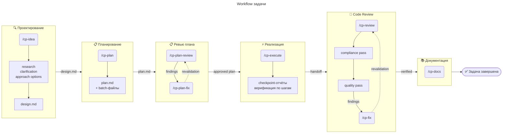
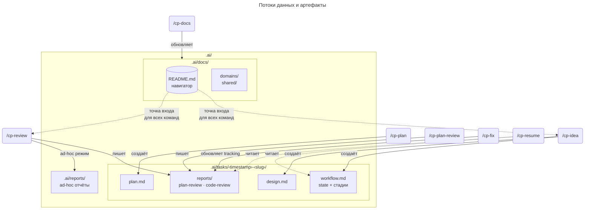
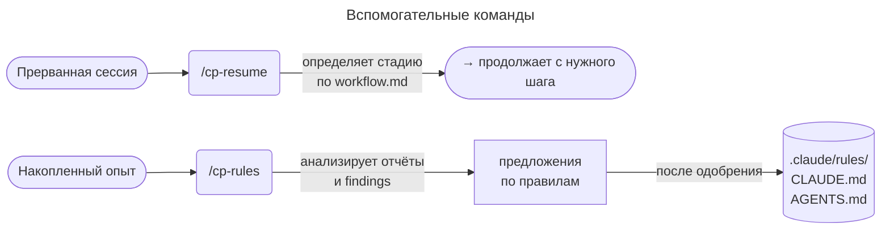

[English](README.md) | **Русский**

# CodePatrol

Workflow-first набор скиллов для [Claude Code](https://docs.anthropic.com/en/docs/claude-code) и [Codex CLI](https://github.com/openai/codex). CodePatrol объединяет всю AI-ориентированную цепочку: исследования, дизайн, планирование, реализация, ревью, фиксы, документацию и правила проекта в одном наборе команд с шаблонами в `templates/` и платформенными значениями в `platforms/*.env`.

## Вдохновение

CodePatrol вдохновлён проектом [Superpowers](https://github.com/obra/superpowers) от Jesse Vincent — пионерским skill-based workflow для coding-агентов. Superpowers показал, что агенты работают значительно лучше, когда их направляют композируемые скиллы, а не ad-hoc промпты.

CodePatrol развивает эту идею, добавляя структурированное хранение артефактов, возобновляемость сессий, compliance-first ревью и полный жизненный цикл задачи с аудит-трейлом.

## CodePatrol vs Superpowers

| Область | Superpowers | CodePatrol |
|---------|------------|------------|
| **Подход** | Композируемые general-purpose скиллы с автоматическим триггером | Полный lifecycle workflow со структурированными стадиями и handoff'ами |
| **Хранение артефактов** | Нет постоянной структуры — контекст живёт в чате | Директория `.ai/`: `workflow.md`, `design.md`, `plan.md`, отчёты |
| **Возобновляемость сессий** | Начинать заново в новой сессии | `/cp-resume` восстанавливает точную стадию из артефактов |
| **Code review** | Однопроходное ревью по плану | Двухпроходное: сначала compliance (дизайн/план/правила), затем quality (арх/безопасность/тесты/конвенции) |
| **Исполнение ревью** | Один ревьювер | Параллельные специализированные ревьюверы (архитектура, безопасность, тесты, конвенции) |
| **Трекинг исправлений** | Вручную | Инкрементальная мутация отчёта — каждый finding с статусом, решением и evidence |
| **Написание плана** | Микрошаговые планы с полным кодом | Адаптивная гранулярность по тиру executor'а; batch-файлы для medium/large задач |
| **Валидация плана** | Нет выделенного шага | Цикл `/cp-plan-review` → `/cp-plan-fix` перед реализацией |
| **Документация** | Нет выделенного шага | `/cp-docs` — AI-ориентированные docs в `.ai/docs/` с ToC, кросс-ссылками и валидацией |
| **Эволюция правил** | Нет выделенного шага | `/cp-rules` — предлагает улучшения правил из отчётов, research или natural language запросов; diagnose mode |
| **Ad hoc режим** | Нет | Любая команда работает вне workflow-задач; `/cp-docs` принимает запросы на естественном языке |
| **Аудит-трейл** | Нет | Append-only отчёты, история решений в workflow.md |
| **Поддержка платформ** | Claude Code, Codex, Cursor, OpenCode | Claude Code, Codex CLI |

Оба проекта под MIT-лицензией. Они могут сосуществовать — Superpowers покрывает общую дисциплину разработки (TDD, worktrees, brainstorming), а CodePatrol фокусируется на структурированном жизненном цикле задачи с артефактами, ревью и аудит-трейлом.

## Содержание

- [Быстрый старт](#быстрый-старт)
- [Вдохновение](#вдохновение)
- [CodePatrol vs Superpowers](#codepatrol-vs-superpowers)
- [Зачем нужен CodePatrol](#зачем-нужен-codepatrol)
- [Обзор workflow](#обзор-workflow)
- [Хранение и организация данных](#хранение-и-организация-данных)
- [Как запускать](#как-запускать)
- [Пример сессии](#пример-сессии)
- [Установка](#установка)
- [Правила и контекст](#правила-и-контекст)
  - [Выбор моделей для субагентов](#выбор-моделей-для-субагентов)
- [Разработка](#разработка)
- [CI/CD](#cicd)
- [Известные ограничения](#известные-ограничения)

## Быстрый старт

**Требования:** установленный [Claude Code](https://docs.anthropic.com/en/docs/claude-code) или [Codex CLI](https://github.com/openai/codex).

```bash
# 1. Установить скиллы
curl -fsSL https://raw.githubusercontent.com/unger1984/codepatrol/main/install-remote.sh | bash

# 2. Открыть проект в Claude Code
cd your-project

# 3. Запустить первую задачу
/cp-idea добавить кэширование в API-слой
```

CodePatrol создаст `.ai/` в проекте, проведёт research, обсудит подход и подготовит дизайн. Затем `/cp-plan` напишет план реализации. Workflow подскажет следующую команду на каждом шаге.

## Зачем нужен CodePatrol

- **Единый пользовательский опыт:** команды скрывают внутренние stage ID и управляют исследованием, дизайном, выполнением, проверками и документированием.
- **Контекст и память:** каждая команда начинает с `.ai/docs/README.md` и берет артефакты из `.ai/tasks/`, так агенты читают только релевантное.
- **Аудит:** `.ai/tasks/` содержит `<slug>.workflow.md`, `<slug>.design.md`, `<slug>.plan.md`, отчеты; изменения фиксируются только в полях отслеживания.

## Обзор workflow







## Хранение и организация данных

CodePatrol создаёт в проекте директорию `.ai/`, которая служит двум целям: долговременная память проекта и артефакты текущих задач.

### `.ai/docs/` — память проекта

Постоянная AI-ориентированная документация. Это не дублирование обычных docs, а отдельный слой знаний, оптимизированный для агентов: архитектурные решения, паттерны проекта, domain-специфичные ограничения.

`README.md` внутри — обязательная точка входа. Каждая команда CodePatrol начинает чтение контекста именно с него, находит по навигации нужные docs и читает только релевантные. Это предотвращает бесцельное сканирование репозитория.

Создаётся и обновляется командой `/cp-docs` — как шаг workflow после завершения задачи, так и через ad hoc запросы на естественном языке.

### `.ai/tasks/` — артефакты задач

Каждая workflow-задача живёт в своей директории: `.ai/tasks/<YYYY-MM-DD-HHMM>-<slug>/`.

Внутри — три основных файла, которые создаёт `/cp-idea` и обновляют последующие команды:

- **`<slug>.workflow.md`** — центральный state-файл. Хранит текущую стадию, статус, ссылки на артефакты, трекинг прохождения стадий и ключевые решения. Именно по нему `/cp-resume` определяет, откуда продолжить работу.
- **`<slug>.design.md`** — дизайн решения. Формируется в `/cp-idea` после research и обсуждения подходов. Один на задачу, правится итеративно.
- **`<slug>.plan.md`** — план реализации. Один на задачу, проходит `/cp-plan-review` перед исполнением.

Внутри задачи также есть `reports/` — отчёты ревью плана и кода. Отчёты являются audit-артефактами: `/cp-plan-fix` и `/cp-fix` обновляют в них только tracking-поля (статус, способ решения, заметки), но не удаляют и не переписывают findings.

### `.ai/reports/` — ad-hoc отчёты

Отчёты вне workflow-задач. Например, `/cp-review` для произвольной ветки или PR сохраняет результат сюда, а не в task-директорию.

### Зачем это нужно

- **Возобновляемость.** Задачу можно продолжить в новой сессии через `/cp-resume` — весь контекст в артефактах, а не в памяти чата.
- **Аудит.** История решений и findings не теряется — отчёты накопительные, workflow.md фиксирует ключевые развилки.
- **Изоляция контекста.** Агенты читают `.ai/docs/README.md` → нужные docs → артефакты задачи → код. Без bulk-чтения репозитория.

## Как запускать

Команды вводятся в Claude Code или Codex CLI. Каждая команда сама находит нужные артефакты из `.ai/tasks/` и `.ai/docs/`. Если контекст неясен — команда спросит.

### Полный workflow задачи

Workflow строится вокруг одной задачи: одна задача = один дизайн + один план (план может быть разбит на batch-файлы, но остаётся единым логическим планом). Задача считается завершённой только после обновления AI-документации.

**1. Проектирование — `/cp-idea`**

Единая точка входа. Команда проверяет, нет ли незавершённых задач, и предлагает продолжить их или начать новую. Для новой задачи запускается обязательная цепочка:
- **research** — сбор контекста из `.ai/docs/`, кода и правил проекта;
- **clarification** — уточнение неясных моментов у пользователя;
- **approach options** — сравнение подходов с trade-offs и рекомендацией;
- **design** — формирование `design.md` со стратегией исполнения.

Глубина процесса адаптируется под задачу: для мелких правок — минимальная, для крупных фич — полная.

**2. Планирование — `/cp-plan`**

Пишет план реализации по утверждённому дизайну. Проверяет готовность контекста (дизайн, правила проекта, карта файлов, контракты), адаптирует гранулярность плана под тир executor'а (стратегический для сильных моделей, детальный для слабых). Для medium и large задач разбивает план на batch-файлы для компактного контекста executor'а.

**3. Ревью плана — `/cp-plan-review` → `/cp-plan-fix`**

Перед реализацией план проверяется на соответствие дизайну, правилам проекта и готовности к исполнению. `/cp-plan-review` сохраняет отчёт с findings, `/cp-plan-fix` закрывает их и проводит bounded revalidation.

**4. Реализация — `/cp-execute`**

Выполняет утверждённый план по шагам с checkpoint-отчётами. Останавливается на блокерах вместо угадывания. По завершении предлагает перейти к code review — в текущей сессии или передать в новую.

**5. Code review — `/cp-review` → `/cp-fix`**

`/cp-review` сначала проверяет compliance (соответствие дизайну, плану и правилам), затем quality (архитектура, стиль, тесты, безопасность). Отчёт сохраняется как `.review.report.md`. `/cp-fix` исправляет findings в порядке приоритета: сначала compliance, потом quality.

**6. Документация — `/cp-docs`**

Обновляет AI-ориентированную документацию в `.ai/docs/` на основе результатов задачи. Проводит validation pass: проверяет навигацию, размещение и соответствие коду.

Также работает в ad hoc режиме: `/cp-docs добавь диаграмму потока данных для модуля авторизации` — парсит запрос, исследует кодовую базу и создаёт или обновляет нужный документ.

### Вспомогательные команды

- `/cp-resume` — продолжить незавершённую задачу. Загружает артефакты, определяет текущую стадию и показывает, что делать дальше.
- `/cp-rules` — не входит в обязательный workflow. Анализирует отчёты, повторяющиеся findings или конкретную тематическую область и предлагает нумерованные улучшения правил по категориям. Поддерживает diagnose mode: «почему правила не сработали?» — исследует причину и предлагает исправления. Изменения применяются только после подтверждения пользователя.

### Примечания

- Любой команде можно передать путь к конкретному артефакту: `/cp-resume .ai/tasks/2026-03-06-1420-my-task/`.
- `/cp-review` также работает вне workflow — можно ревьюить ветку, PR, директорию или набор файлов.
- Если команда спрашивает «какой артефакт?», ответьте путём или коротко: «текущая задача», «новая задача».

## Пример сессии

```
> /cp-idea добавить rate limiting для API

🔍 Research: читаю .ai/docs/README.md → docs/domains/api.md → src/api/...
Найдено: Express + Redis, 12 эндпоинтов, аутентификация через JWT.

❓ Уточнение:
  1. Лимитировать все эндпоинты одинаково или разделить по группам?
  2. Хранить счётчики в Redis (уже в проекте) или in-memory?
  → Рекомендую: Redis + разные лимиты для auth и data эндпоинтов.

> 1 — по группам, 2 — Redis, согласен с рекомендацией

📐 Design: создан .ai/tasks/2026-03-06-1420-rate-limiting/rate-limiting.design.md
   Следующий шаг → /cp-plan

> /cp-plan

📋 Plan: создан rate-limiting.plan.md (3 этапа, 2 batch-файла)
   Rules compliance pre-check: пройден
   Следующий шаг → /cp-plan-review

> /cp-plan-review

✅ Findings: 1 minor (не указан fallback при недоступности Redis)
   Следующий шаг → /cp-plan-fix

> /cp-plan-fix

🔧 Исправлено: добавлен fallback на in-memory counter.
   Revalidation пройдена. Следующий шаг → /cp-execute

> /cp-execute

⚡ Этап 1/3: middleware создан, тесты проходят
⚡ Этап 2/3: конфиг лимитов по группам, интеграционные тесты ок
⚡ Этап 3/3: документация обновлена
   Реализация завершена. Следующий шаг → /cp-review

> /cp-review

📝 Compliance: ок (соответствует дизайну и плану)
📝 Quality: 1 important (middleware не логирует rejected запросы)
   Отчёт: .ai/tasks/.../reports/...-rate-limiting.review.report.md
   Следующий шаг → /cp-fix

> /cp-fix

🔧 Добавлено логирование. Верификация пройдена.
   Следующий шаг → /cp-docs

> /cp-docs

📚 Обновлён .ai/docs/domains/api.md (добавлена секция rate limiting)
   Задача завершена.
```

## Установка

### Последний релиз

```bash
# Claude Code
curl -fsSL https://raw.githubusercontent.com/unger1984/codepatrol/main/install-remote.sh | bash

# Codex CLI
curl -fsSL https://raw.githubusercontent.com/unger1984/codepatrol/main/install-remote.sh | bash -s codex
```

### Claude marketplace plugin

```text
/plugin marketplace add unger1984/codepatrol
/plugin install codepatrol@codepatrol-marketplace
```

### Из исходников

```bash
git clone https://github.com/unger1984/codepatrol.git
cd codepatrol
./install.sh claude
./install.sh codex
```

Installer удаляет legacy review-директории и устанавливает только текущий набор workflow-команд.

## Правила и контекст

### Откуда берутся правила проекта

CodePatrol не вводит свой формат правил — он использует то, что уже есть в платформе:

| Платформа | Источники правил |
|-----------|-----------------|
| Claude Code | `.claude/rules/*.md`, `CLAUDE.md` |
| Codex CLI | `AGENTS.md` |

Команды `/cp-plan`, `/cp-review`, `/cp-plan-review` и `/cp-execute` автоматически читают правила проекта и учитывают их при планировании, ревью, валидации и реализации. `/cp-rules` анализирует накопленные результаты и предлагает добавить или обновить правила.

### Языковая политика

CodePatrol автоматически адаптирует язык под проект:

1. **Правила проекта** — если в `CLAUDE.md` или `AGENTS.md` указан язык (например, «Responses in Russian»), все артефакты (`design.md`, `plan.md`, отчёты, `.ai/docs/`) и ответы пользователю будут на этом языке.
2. **Язык клиента** — если правила проекта не задают язык, используется язык, настроенный в агенте или клиенте.
3. **Fallback** — если язык нигде не указан, артефакты создаются на английском.

Исключение: `workflow.md` всегда ведётся на английском — это state-файл для агентов, а не документация.

### Выбор моделей для субагентов

Команды, запускающие субагентов (`/cp-idea`, `/cp-plan`, `/cp-review`, `/cp-execute`), используют трёхуровневую систему моделей:

| Тир | Описание | Примеры задач |
|-----|----------|---------------|
| **fast** | Самая дешёвая/быстрая доступная | Ревью конвенций, правки одного файла, шаблонный код |
| **default** | Средний уровень | Ревью архитектуры/безопасности/тестов, реализация в нескольких файлах |
| **powerful** | Самая мощная доступная | Compliance-ревью, кросс-модульный рефакторинг, задачи, упавшие на младшем тире |

**Как это работает:**
- Оркестратор выбирает минимальный тир, достаточный для задачи.
- **Правило потолка:** субагент не может использовать более мощную модель, чем сессия оркестратора. Если вы работаете на Sonnet — субагенты не поднимутся выше Sonnet.
- **Эскалация:** если субагент упал (ошибка, пустой результат, не прошёл самопроверку), он перезапускается на тир выше. Максимум одна эскалация. Если потолок не помог — блокер.
- `/cp-idea` (research, дизайн, планирование) рекомендуется запускать на самой мощной модели — команда предупредит, если текущая модель может быть недостаточной.

**Пользовательский маппинг моделей:**

Добавьте в `CLAUDE.md` или `AGENTS.md`:

```markdown
## CodePatrol model tiers
- fast: claude-haiku-4-5-20251001
- default: claude-sonnet-4-6
- powerful: claude-opus-4-6
```

Если маппинг указан в правилах проекта, он имеет приоритет над автоматическим выбором.

### Контекст и `.ai/docs/`

Все команды начинают чтение контекста с `.ai/docs/README.md` и по навигации находят нужные docs. Это предотвращает ситуации, когда агент сканирует весь репозиторий «на всякий случай», и обеспечивает стабильное поведение даже в больших кодовых базах.

## Разработка

```text
templates/                        source-of-truth шаблоны скиллов
platforms/                        платформенные значения placeholder'ов
skills/                           сгенерированный output из ./install.sh build
.claude-plugin/                   манифесты Claude marketplace
install.sh                        локальная сборка и установка
install-remote.sh                 installer для релизов
```

```bash
./install.sh build
./install.sh claude
./install.sh codex
```

## CI/CD

CI пересобирает `skills/`, проверяет актуальность generated output, валидирует substitution placeholder'ов и ожидаемую структуру runtime-навыков `cp-*` для release assets.

## Известные ограничения

- Основная проверка была на macOS.
- Поддержка Cursor пока не реализована.

## Лицензия

MIT
