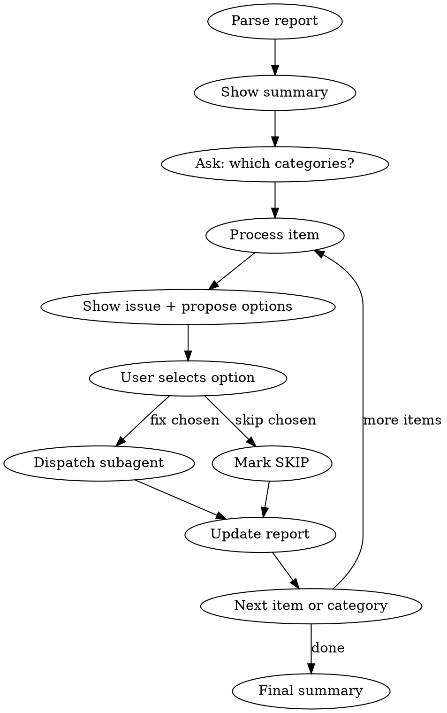

# Code Review Fix

Interactive fix processor for code review reports. Works through each issue, proposes fix options with pros/cons, dispatches subagents for execution, and tracks progress by mutating the report file.

**Core principle:** User decides, subagent executes, report tracks everything.

## When to Use

- After `code-review` generates a report
- To process a saved report from `docs/plans/`
- When user invokes `/code-review-fix`

## Arguments

| Argument | Source | Example |
|----------|--------|---------|
| `<path>` | Read report from file | `/code-review-fix docs/plans/2026-03-04-code-review-report.md` |
| (none) | Use report from current conversation context | `/code-review-fix` (only works right after code-review) |

### Resolving source

**Mode-aware asking rule:**
- If interactive question tool is available in the current mode, use `AskUserQuestion`.
- If it is unavailable in the current mode, ask a plain-text question in chat with explicit options and continue after the user's reply.

1. If a file path is provided — read the file
2. If no argument — look for a code review report in the current conversation context (the output of a previous `code-review` run in this session)
3. If neither found — ask user using the mode-aware asking rule:
   - "Provide path to report file"
   - "Run /code-review first"

## Workflow



### Step 1: Parse Report

Extract from the report markdown:
- **Header:** date, scope, branch
- **Summary:** counts per severity
- **Items:** for each issue extract:
  - `severity` (Critical / Important / Minor)
  - `number` (1, 2, 3...)
  - `category` ([SECURITY], [ARCHITECTURE], [CODESTYLE], [TESTING])
  - `title` (text after category)
  - `existing_status` (DONE / SKIP / CHANGED / RESOLVED_BY — if present, skip this item)
  - `file` and `lines` from **File:** field
  - `problem` from **Problem:** field
  - `fix` from **Fix:** field (including code blocks)

**Skip items that already have a status** (DONE, SKIP, CHANGED, RESOLVED_BY). These were processed in a previous session.

### Step 2: Show Summary and Select Categories

Display to user:
```
Report: {report_title}
Total: {N} items ({N_remaining} remaining)
- Critical: {N} ({N_remaining} remaining)
- Important: {N} ({N_remaining} remaining)
- Minor: {N} ({N_remaining} remaining)
```

Then ask user using the mode-aware asking rule:
```
question: "Which categories to process?"
options:
- "All (Critical + Important + Minor)"
- "Critical + Important" (Recommended)
- "Critical only"
```

### Step 3: Process Each Item

For each item in selected categories (order: Critical -> Important -> Minor):

#### 3a: Check if already resolved

Before presenting the item, quickly check if the file/lines have already been modified by a previous fix in this session. If the problem described no longer exists:
- Mark as `— RESOLVED_BY {severity_short}#{prev_number}` (e.g., `RESOLVED_BY C#3`)
- Tell the user: "Item #{N} resolved by previous fix #{M}"
- Move to next item

#### 3b: Present the issue

Show to the user:
```
[{severity} #{number}] [{category}] {title}
File: {file}:{lines}
Problem: {problem}
```

#### 3c: Propose fix options

Ask with options using the mode-aware asking rule. The number and content of options depends on complexity:

**For complex issues** (security, architecture, significant logic changes):
- Option A: Fix from report (label: brief description, marked "Recommended")
  - description: "+" pros, "-" cons (2-4 bullet points)
- Option B: Alternative approach
  - description: "+" pros, "-" cons
- Option C (if applicable): Another alternative
- Last option: "Skip"

**For simple issues** (renames, dead code, comments, formatting):
- Option A: "Apply fix from report (Recommended)"
- Option B: "Skip"

**Generating alternatives:** Think about what other valid solutions exist for the same problem. Consider:
- Different implementation patterns (e.g., try/catch vs constraint-based handling for race conditions)
- Different granularity (minimal fix vs broader refactoring)
- Framework-specific alternatives (if the project uses a specific framework)

If only one reasonable fix exists — don't invent artificial alternatives. Just offer "Apply" + "Skip".

#### 3d: Execute chosen fix

If user chose a fix (not Skip):

1. Read the `fix-agent-prompt.md` template from this skill directory (`~/.claude/skills/code-review-fix/fix-agent-prompt.md`)
2. Substitute variables:
   - `{ISSUE_TITLE}` — category + title (e.g., "[SECURITY] Race condition on registration")
   - `{SEVERITY}` — Critical/Important/Minor
   - `{NUMBER}` — item number within its severity category
   - `{FILE_PATH}` — target file path
   - `{LINES}` — target line range
   - `{PROBLEM_DESCRIPTION}` — problem text from the report
   - `{CHOSEN_FIX}` — the fix text + code for the option user selected. If user selected an alternative (not the report fix) — describe the alternative fix clearly with code
   - `{PROJECT_RULES}` — read from `.claude/rules/*.md` and `CLAUDE.md`
3. Dispatch subagent:
   ```
   Agent(subagent_type="general-purpose", prompt=<substituted fix-agent-prompt>)
   ```
4. Report subagent result to user (1-2 lines: what was done, lint/test status)

#### 3e: Update report file

Edit the report file to record the outcome. Add status suffix to the issue heading:

**DONE** (fix from report applied as-is):
```markdown
### 1. [SECURITY] Race condition on registration — DONE
```

**SKIP** (user skipped):
```markdown
### 1. [SECURITY] Race condition on registration — SKIP
```

**CHANGED** (alternative fix applied):
```markdown
### 1. [SECURITY] Race condition on registration — CHANGED: Used UPSERT instead of try/catch
```
Also update the **Fix:** block in the report to reflect what was actually applied.

**RESOLVED_BY** (already fixed by previous item):
```markdown
### 5. [CODESTYLE] `.then()` chains — RESOLVED_BY C#3
```

### Step 4: Category Transition

After finishing all items in a category:
- Show mini-summary: "{Category}: {N} done, {N} skipped, {N} changed"
- If more categories selected — continue to next
- If not — go to Step 5

### Step 5: Final Summary

Display:
```
Fix session complete.

Results:
- Done: {N} (applied as recommended)
- Changed: {N} (applied alternative)
- Skipped: {N}
- Resolved by other fixes: {N}
- Remaining (not processed): {N}

Report updated: {report_file_path}
```

## Important

- **Never auto-fix.** Always ask user before each item using the mode-aware asking rule.
- **Subagent per fix.** Each fix is a separate subagent call — keeps context fresh.
- **Mutate report.** The report file is the single source of truth for progress.
- **Resumable.** Items with existing status are skipped — user can run the skill again to continue where they left off.
- **Lint + tests mandatory.** Subagent must verify lint passes and tests pass (if affected) before returning.
- **No commits.** Neither this skill nor the subagent should commit. User commits when ready.
- **Comments.** Code comments added by subagent should follow the project's language conventions, plain "why" explanations without prefixes.
