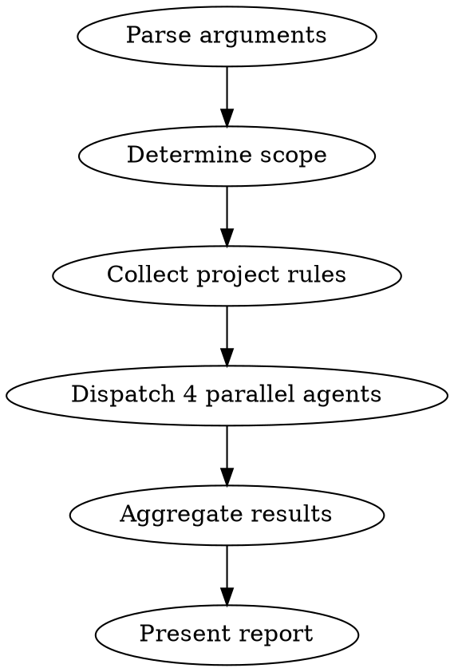

# Code Review

Parallel review dispatcher. Launches 4 subagents (codestyle, architecture, testing, security), each checking code against its own checklist using the current project's rules.

**Core principle:** Parallel review by domain — fast and focused.

## When to Use

- After completing a task or feature
- Before merge/PR
- On user request (`/code-review`)
- As a checkpoint during subagent-driven development

## Arguments

### Flags (explicit)

| Flag | Scope | Example |
|------|-------|---------|
| (none) | Committed diff: current branch vs main | `/code-review` |
| `--diff <base>` | Committed diff: current branch vs specified base | `/code-review --diff dev` |
| `--uncommitted` | Uncommitted changes (staged + unstaged + untracked) | `/code-review --uncommitted` |
| `--all` | All source files in project | `/code-review --all` |
| `--pr [number]` | PR diff: changed files in a pull request | `/code-review --pr 42` or `/code-review --pr` (current branch PR) |
| `--plan <path>` | Review the **plan document itself** against project rules | `/code-review --plan docs/plans/plan.md` |
| `--impl <path>` | Review **code implementing** the plan (extract file paths from plan, check code) | `/code-review --impl docs/plans/plan.md` |
| paths | Specific files/directories | `/code-review src/modules/auth/` |

### Natural language (interpreted)

If the argument is free text (not a flag or path), interpret user intent:

| User says | Interpreted as |
|-----------|---------------|
| "current branch", "branch vs main" | default (committed diff vs main) |
| "branch X vs Y", "diff X Y" | `--diff Y` (diff current branch vs Y). If X is not the current branch — checkout or warn |
| "uncommitted code", "working changes" | `--uncommitted` |
| "all code", "entire project", "everything" | `--all` |
| "review the PR", "PR #42", "pull request" | `--pr` (with number if given, else current branch) |
| "check the plan" + path | `--plan` (review the plan document) |
| "check implementation of" + path | `--impl` (review code implementing the plan) |

### When in doubt — ask with options

**If you cannot confidently determine scope, OR if the determined scope is empty — ask with concrete options.**

**Mode-aware asking rule:**
- If interactive question tool is available in the current mode, use `AskUserQuestion`.
- If it is unavailable in the current mode, ask a plain-text question in chat with 2-4 explicit options and continue after the user's reply.

Two triggers:
1. **Can't determine scope** — user input is ambiguous
2. **Scope is empty** — determined scope returned 0 files

In both cases: tell the user what happened, then offer options using the mode-aware asking rule above.

**Examples:**

User says "check this" → no clear scope:
```
Ask: "What exactly to review?"
Options:
- "Uncommitted changes" (N files)
- "Branch vs main" (N commits)
- "Current branch PR"
- Other
```

User says nothing (default), but committed diff is empty:
```
Ask: "Committed diff vs main is empty. What to review?"
Options:
- "Uncommitted changes" (N files)
- "Entire project"
- "Specific module/path"
- Other
```

User mentions `.md` file without clarification:
```
Ask: "What to review?"
Options:
- "The plan document itself"
- "Code implementing the plan"
- Other
```

User says "changed code" — ambiguous:
```
Ask: "Which changes to review?"
Options:
- "Committed (branch vs main)"
- "Uncommitted (working changes)"
- Other
```

**Rules:**
- Always show counts where possible (N files, N commits) — helps user decide
- Always include "Other" (AskUserQuestion adds it automatically) when using interactive tool mode
- In plain-text fallback mode, include an explicit "Other (describe)" option
- After user answers — proceed without asking again

**Never guess scope. Never review 0 files silently. Wrong scope = wasted review.**

## Workflow



### Step 1: Determine Scope

Determine which files to review based on parsed arguments:

**Default (no args) — committed diff vs main:**
```bash
MAIN_BRANCH=$(git symbolic-ref refs/remotes/origin/HEAD 2>/dev/null | sed 's@^refs/remotes/origin/@@' || echo "main")
git diff --name-only ${MAIN_BRANCH}...HEAD
```

**`--diff <base>` — committed diff vs custom base branch:**
```bash
git diff --name-only <base>...HEAD
```

**`--pr [number]` — pull request diff:**
```bash
# With PR number:
gh pr diff 42 --name-only
# Without number — find PR for current branch:
gh pr diff --name-only
```
Also fetch PR description via `gh pr view [number] --json body` — pass it as context to subagents alongside `{DESIGN_DOC}`.

**`--uncommitted` — all uncommitted changes:**
```bash
# Modified + staged + untracked (excluding build artifacts, lock files)
(git diff --name-only HEAD; git ls-files --others --exclude-standard) | sort -u
```
If committed diff is empty but uncommitted changes exist — suggest `--uncommitted` to the user.

**`--all` — entire project:**
Detect the project's primary language(s) from existing files, then collect all source files. Exclude: build output, dependencies (node_modules, vendor, venv, etc.), generated files, lock files, migrations.

**`--plan <path>` — review the plan document itself:**
1. Read the plan `.md` file
2. Collect project rules (`.claude/rules/*.md`, `CLAUDE.md`, codestyle)
3. Review the plan against: project conventions, architectural rules, naming, completeness
4. **No code files are reviewed** — only the plan document
5. Subagents check: does the plan follow project patterns? Are steps complete? Are there gaps?

**`--impl <path>` — review code implementing a plan:**
1. Read the plan file
2. Extract file paths from `**Files:**` sections (both `Create:` and `Modify:`)
3. Review only those files (they must exist on disk)
4. Pass the plan as `{DESIGN_DOC}` for plan compliance checking

**Specific paths:** use as-is. If a directory — find all source files inside it.

**Always filter** (except `--plan` mode): only source code files relevant to the project's language(s). Exclude build output, dependencies, generated files, lock files.

### Step 2: Collect Project Rules

Read project rules for subagent prompts:

1. **`.claude/rules/*.md`** — all rule files (Glob `**/.claude/rules/*.md`)
2. **`CLAUDE.md`** — root and nested (Glob `**/CLAUDE.md`)
3. **`docs/plans/*-design.md`** — design documents (if present, for plan compliance check)

Build a concise summary of rules for each subagent — pass only relevant sections, not everything to everyone.

### Step 3: Dispatch Parallel Agents

Launch 4 subagents **simultaneously** via Agent tool (single message with 4 tool use blocks):

```
Agent(subagent_type="code-reviewer", prompt=<codestyle-reviewer.md with substituted values>)
Agent(subagent_type="code-reviewer", prompt=<architecture-reviewer.md with substituted values>)
Agent(subagent_type="code-reviewer", prompt=<testing-reviewer.md with substituted values>)
Agent(subagent_type="code-reviewer", prompt=<security-reviewer.md with substituted values>)
```

Each prompt comes from the corresponding file in the skill directory. Substitute:
- `{FILES}` — list of files to review
- `{PROJECT_RULES}` — relevant project rules
- `{DESIGN_DOC}` — design document contents (if present)

### Step 4: Aggregate and Report

Collect results from all 4 subagents into a single report:

```markdown
## Code Review Report

### Summary
- Scope: N files ({scope_description})
- Critical: N | Important: N | Minor: N

### Critical Issues
1. [CATEGORY] `file:line` — description
   **Fix:** brief solution (if multiple options — list as A/B/C with trade-offs)

### Important Issues
1. [CATEGORY] `file:line` — description
   **Fix:** brief solution (if multiple options — list as A/B/C with trade-offs)

### Minor Issues
1. [CATEGORY] `file:line` — description
   **Fix:** brief solution

### Strengths
...

### Assessment
NEEDS_CHANGES | APPROVED | APPROVED_WITH_NOTES
```

**CRITICAL: Every issue at every severity level MUST include a `**Fix:**` field with a concrete solution and code snippet where applicable. Never omit Fix — it is the most actionable part of the review. An issue without a Fix is useless.**

**Aggregation rules:**
- Deduplication: if two subagents found the same issue — keep one with both tags
- Severity: Critical > Important > Minor. If subagents disagree — take the highest
- Assessment: NEEDS_CHANGES if any Critical. APPROVED_WITH_NOTES if only Important/Minor. APPROVED if no issues
- **Fix preservation:** when aggregating subagent results, always preserve the Fix from the subagent output. If the Fix contains a code snippet — include it in the final report. Never summarize issues as one-liners without Fix.

### Step 5: Post-Review Actions

After presenting the report to the user, offer next steps using the mode-aware asking rule above:

```
question: "What to do with the review report?"
options:
- "Save report to docs/plans/" — save only
- "Save and fix now" (Recommended) — save, then start fixing
- "Save for later" — save, show command for next session
```

**Save format:** `docs/plans/YYYY-MM-DD-code-review-report.md`
- If file already exists — append branch name: `docs/plans/YYYY-MM-DD-code-review-report-{branch}.md`

**Actions by choice:**

- **"Save report":** Write report to file. Done.
- **"Save and fix now":** Write report to file, then invoke: `Skill(skill="code-review-fix", args="<saved_file_path>")`
- **"Save for later":** Write report to file, display: `To process fixes later: /code-review-fix <saved_file_path>`

## Important

- **Report only.** Do not fix code directly. Post-review actions (Step 5) hand off to `code-review-fix` skill.
- **Dynamic rules.** Always read current project's rules, never rely on memory.
- **Parallelism.** All 4 subagents launch simultaneously in one message.
- **Don't duplicate linter.** Don't check what the project's linter already covers (formatting, unused vars). Focus on semantics.
